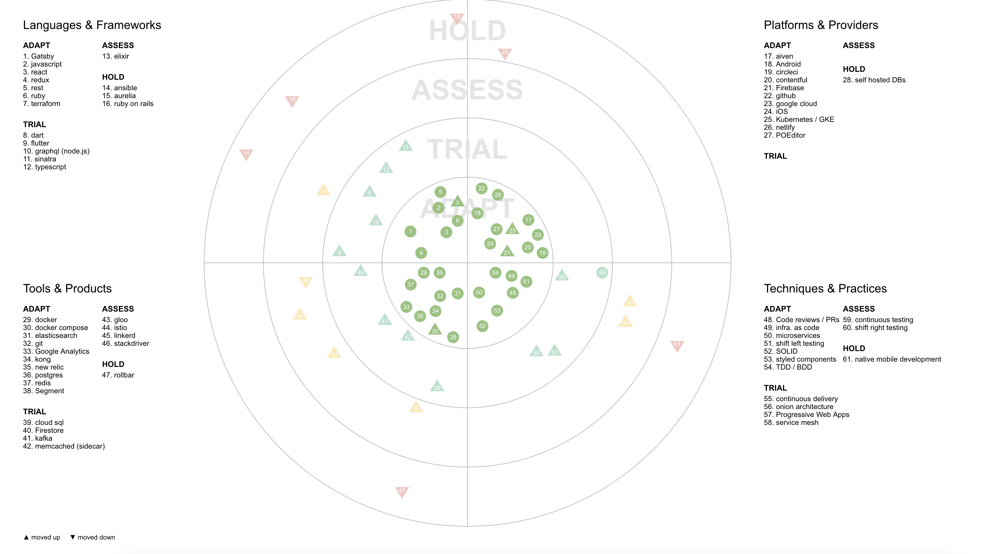

# Techradar
The Radar is a document that sets out the changes that we think are currently interesting in software development - things in motion that we think you should pay attention to and consider using in your projects. It reflects the idiosyncratic opinion of a bunch of freska technologists and is based on our day-to-day work and experiences.

## Interactive version
Clone this repo and open `index.html` in your favorite browser

## Making changes
All data is kept in `radar_data.js`. Make changes and open a PR.
